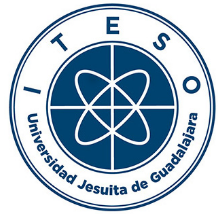

<a name="logo"/>

</a>

# Master Thesis: Deep Learning Approach to remove unwated Acoustic Effects of an Audio Signal

* [Description](#)[Description)
* [Directory Structure](#Directory-structure)
* [Contents](#directory-contents)
* [Requirements](#requirements)
* [Links](#links)
* [Contact](#contact)

## Description

Master thesis of Adrian Ramos Perez to obtain the grade of Master of Science in Data Science.
This code implements a deep learning model to solve the problem of retrieving an original audio signal that has been reproduced in an environment whose affects is negatively.

## Directory Structure:

	code/
	├── Thesis_ARP.ipynb
	└── Thesis_ARP.py
	data/
	│	├── artifacts/
	│	├── metadata/
	│	├── raw/
	environment.yaml
	├── Dockerfile
	├── README.md
	├── requirements.txt
	├── code/
	│	└──.py
	├── 
	│		└── 
	│	├── test/
	│	├── train/
	│	└── val/
	docs/
	figures/
	├── mlruns/
	├── models/
	│	├── artifacts/
	│	├── metadata/
	│	└── others/
	tests/
	│	├── unit
	│	├── integration
	│	└──
	.github/
	└── workflows/
		└── cicd.yaml
		

# Directory Contents

| Directory | Contenidos       |
| -         | -                |
| `code/`   | Model experimentation and training code |
| `data/`   | Data splitted into train, validation y test. Speech audio files in english and spanish|
| `docs/`   | Documentation    |
| `figures/`| Graphics of Loss function, R2, signals and metrics        |
| `models/` | Models artifacts                                             |
| `mlruns/` | MLflow experimentation traceability. Includes artifacts, model metrics.  |
| `tests/`    | Unit tests.  |
| `.github/workflows/`     | GitHub actions for CI/CD pipeline.  |

# Requirements

## List of tasks (completed and undone)

- [x] Basic experimentation tasks:
	- [x] Audio extraction
	- [x] Convolution of input matrix with an impulse response.
	- [x] Lag matrix generation.
- [x] Traing a functional model and baseline it.

# Links

# Contact 📫

E-Mail: <a href="mailto:adrian.ramos@iteso.mx">adrian.ramos@iteso.mx</a> / <a href="mailto:ing.adrian.ramos@outlook.com">ing.adrian.ramos@outlook.com</a> / <a href="mailto:adrian.ramos.ds@gmail.com">adrian.ramos.ds@gmail.com</a></li>

LinkedIn: <a href="https://www.linkedin.com/in/adrianramosds/">adrianramosds</a>
